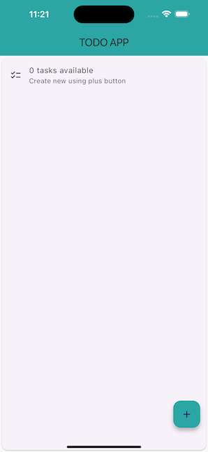

# Flutter To-do App

This is a simple Todo application built using Flutter, a framework for building beautiful, native apps for mobile, web, desktop, and beyond. This project served as a learning experience to explore the fundamentals of Flutter development.

**Features**

- Create new to-do items
- Mark items as completed
- Delete unwanted items
- Persist data using a local storage solution (Hive)



## Getting Started

Ensure you have Flutter and Dart installed on your system. You can find installation instructions on the official Flutter website: [https://docs.flutter.dev/get-started/install](https://docs.flutter.dev/get-started/install)

```bash
$ git clone https://github.com/jaygaha/flutter-first-app.git
```

Run the app:

- Open a terminal in the project directory.
- Run `flutter pub get` to install dependencies.
- Start the app using `flutter run`.

## Learning Outcomes

- Basic programming fundamentals
  - Variables
  - Math operators
  - Comparison operators
  - Logical operators
  - Conditional operators
  - Iteration
  - Functions
  - Data Structures
- Widgets
- State Management
- User interaction
- Data Persistence

## Contribution

Feel free to extend this app with your own creative ideas and contribute them back to the project (if using a version control system like Git).

**Further Enhancements**

Some ideas to extend the app:

- Prioritization
- Due Dates
- Categories

## Reference

- [Mitch Koko](https://www.youtube.com/watch?v=HQ_ytw58tC4&t=4228s)
